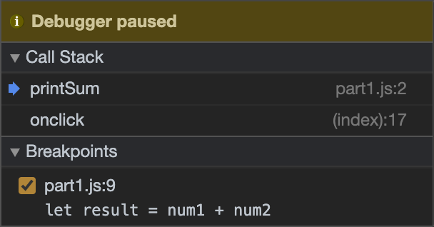
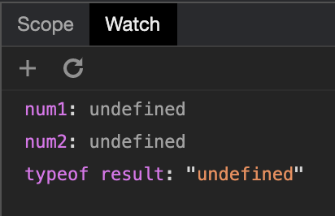

Screenshot of breakpoints:  

  

Screenshot of watch expressions:  

  
What was the bug?:   
The bug was that `num1` and `num2` were both fetched as type string, so when the `+` was being applied on these operands it was concatenating these strings instead of actually athremitcally adding these numbers.
  

How would you fix it?:  
